# Fashion Store Rwanda

A modern E-Commerce Web Application developed with Django for a fashion business in Rwanda. The platform allows customers to browse products, add items to a shopping cart, place orders, and manage their purchases online.

## Features

### Customer Features

* User Registration and Login
* Product Browsing by Category
* Product Details Page
* Shopping Cart Management
* Checkout and Order Placement
* Order History Tracking
* User Profile Management

### Admin Features

* Django Admin Panel
* Product Management
* Category Management
* Order Management
* Analytics Dashboard
* Revenue and User Statistics

## Product Categories

* Women Fashion
* Men Fashion
* Shoes
* Accessories

## Technologies Used

### Backend

* Python 3
* Django 6

### Frontend

* HTML5
* CSS3
* JavaScript

### Database

* SQLite3

### Other Libraries

* Pillow (Image Handling)

### Deployment & Containerization

* Docker
* Docker Compose

## Project Structure

fashion_store/
├── config/
├── store/
├── media/
├── static/
├── templates/
├── Dockerfile
├── docker-compose.yml
├── requirements.txt
└── manage.py

## Installation

### Clone Repository

```bash
git clone https://github.com/emma159-code/fashion_store.git
cd fashion_store
```

### Create Virtual Environment

```bash
python -m venv venv
```

### Activate Environment

Windows:

```bash
venv\Scripts\activate
```

### Install Dependencies

```bash
pip install -r requirements.txt
```

### Run Migrations

```bash
python manage.py migrate
```

### Create Superuser

```bash
python manage.py createsuperuser
```

### Start Server

```bash
python manage.py runserver
```

## Application URL:

https://fashion-store-8xgm.onrender.com

## Docker Setup

### Build Docker Image

```bash
docker build -t fashion-store .
```

### Run Docker Container

```bash
docker run -p 8000:8000 fashion-store
```

### Using Docker Compose

```bash
docker-compose up --build
```

## Analytics Dashboard

The system includes an administrator dashboard displaying:

* Total Products
* Total Orders
* Total Registered Users
* Total Revenue

## Security Features

* User Authentication
* Login Required Pages
* Admin-Only Dashboard
* CSRF Protection
* Secure Password Storage

## Screenshots

## Homepage

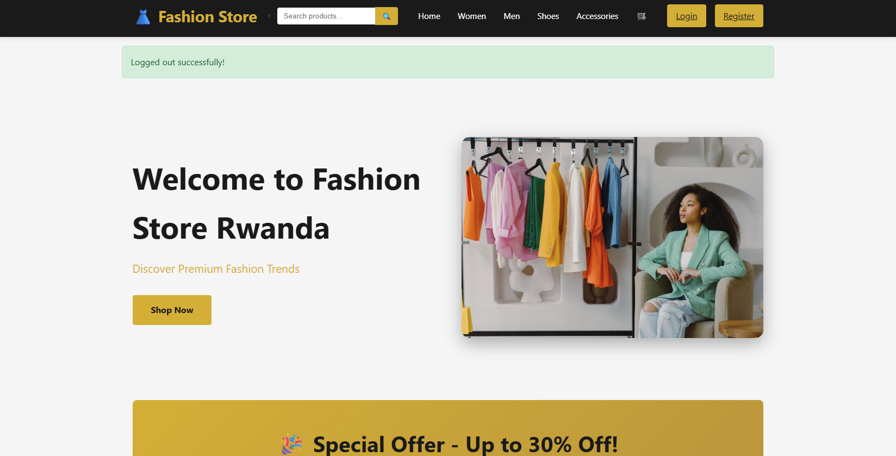
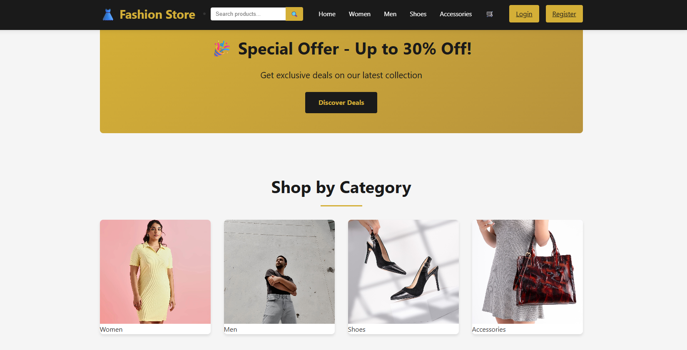
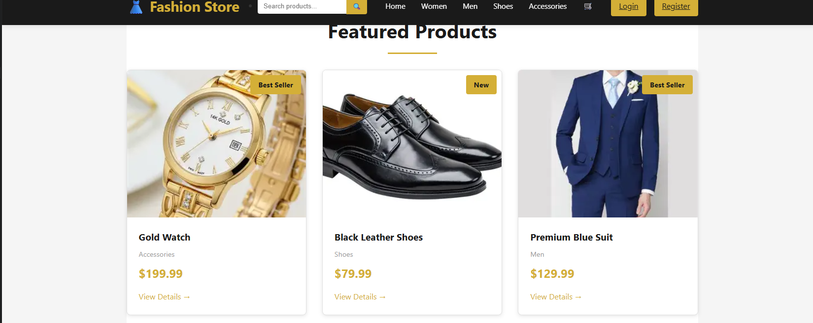
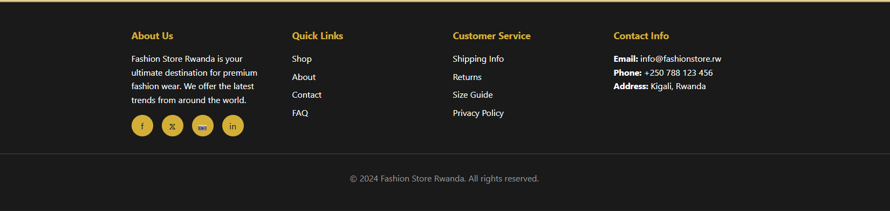

## Login

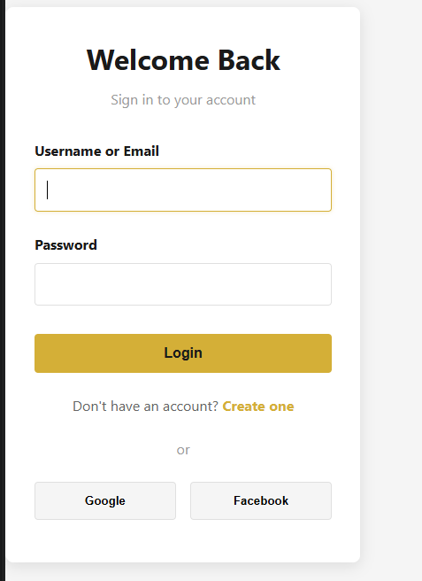

## Register

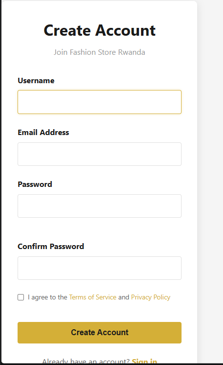

## Product Details

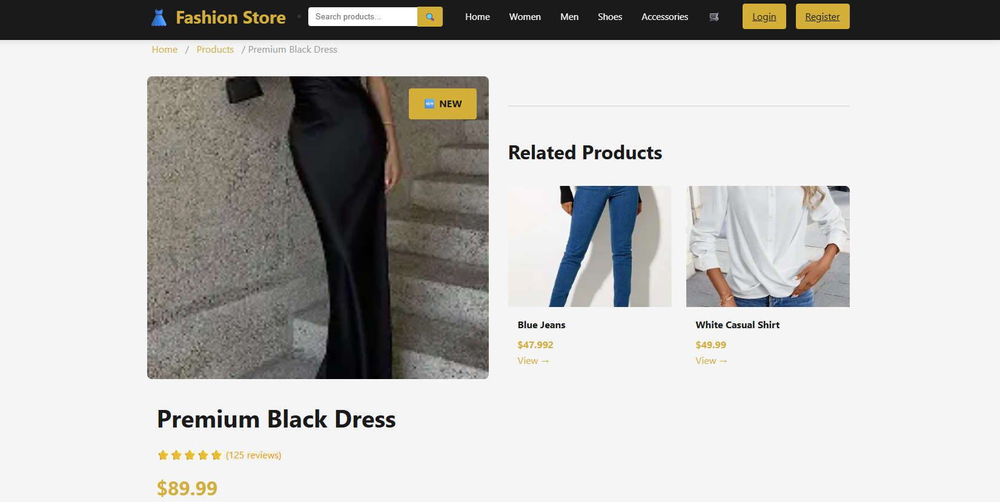
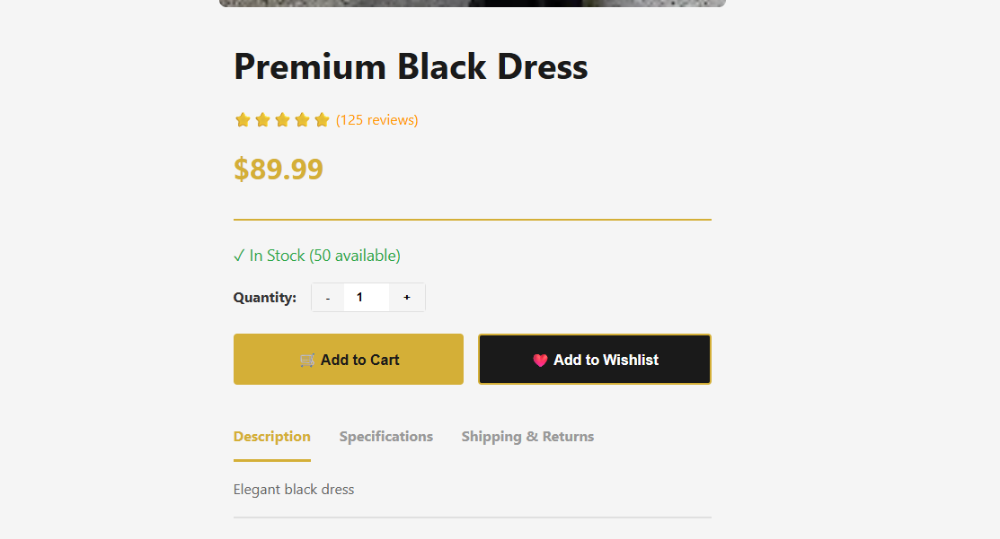

## Shopping cart

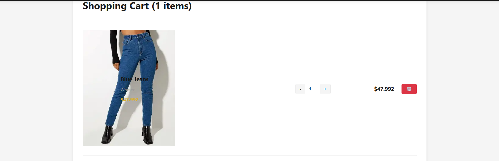
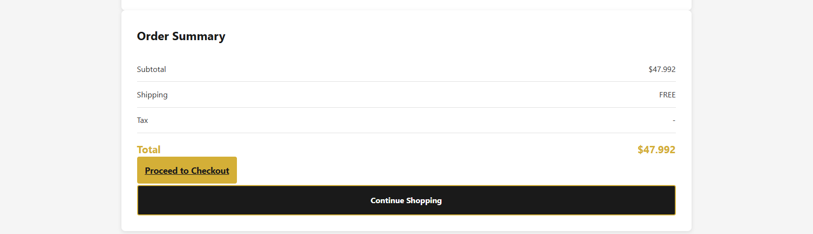

## Checkout Page

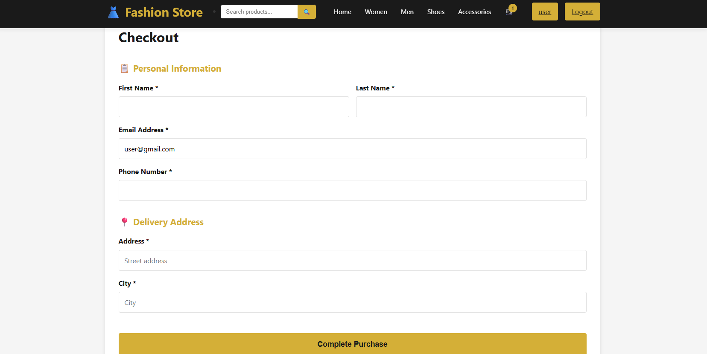

## Django Admin Panel

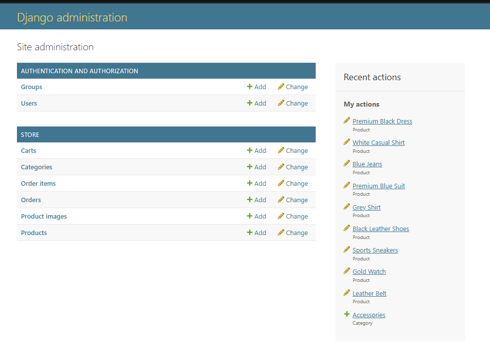

## Admin Dashboard

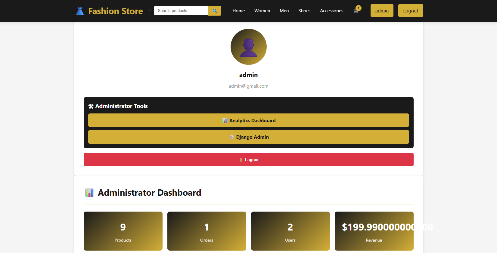

## User profile

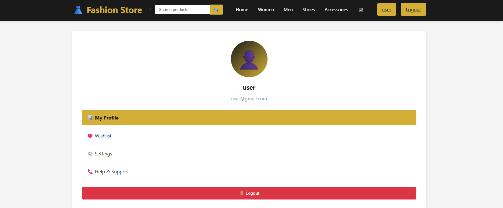
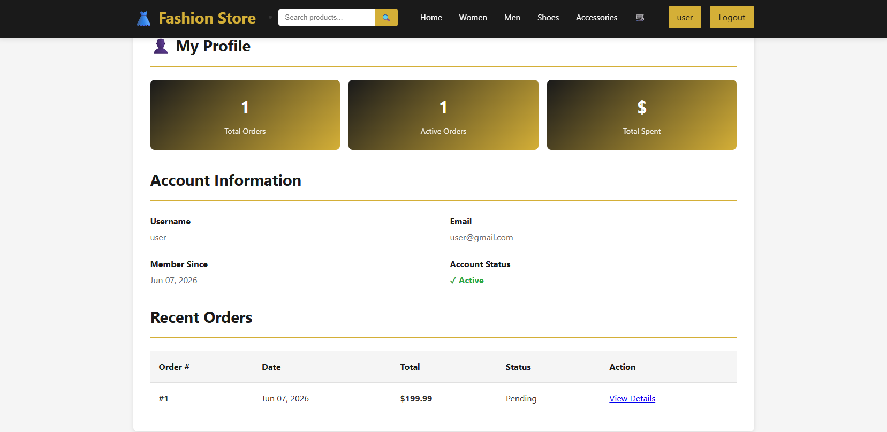


## Author

Emmanuella Akanda

## License

This project was developed for academic purposes as part of a Web Application Development course.
